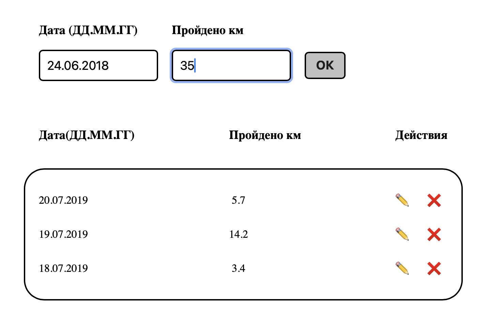
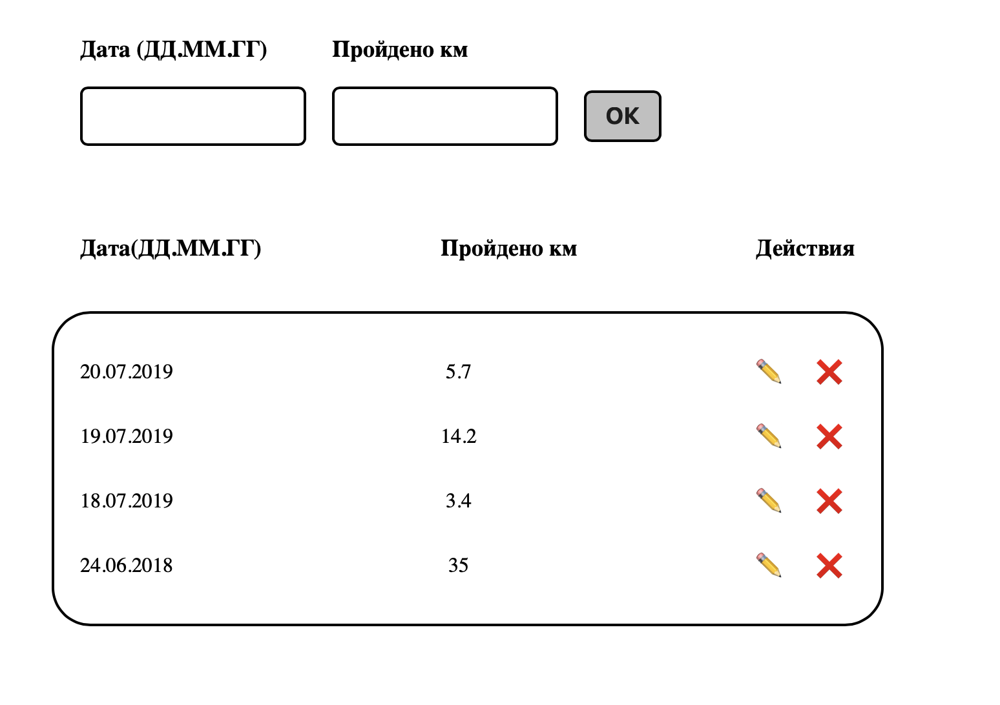

# Training Steps

Training Steps is a small JavaScript application for tracking running or walking progress.

The app allows users to add a training date and distance in kilometers. All records are displayed in a list and sorted by date.

---

## Features

- Add training records
- Enter date and distance
- Sort records by date
- Edit records
- Delete records
- Simple and clean interface

---

## Technologies

- JavaScript
- HTML
- CSS

---

## Screenshots

### Adding a new record



### Training records list



---

## Run the project

```bash
npm run start